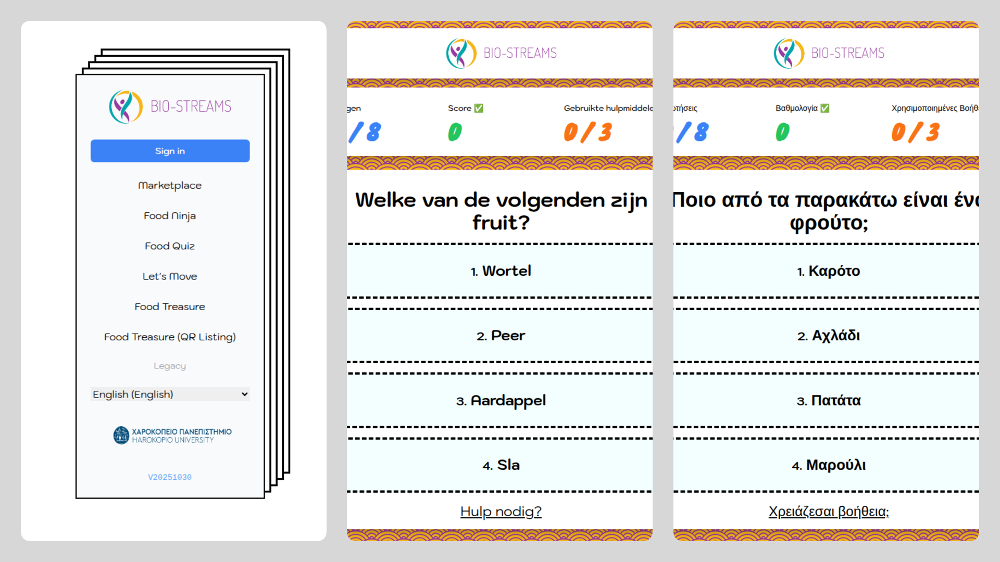

# 

# BIO-STREAMS Marketplace & Serious Games – Translation Automation Toolkit

This repository contains the automated translation and localization pipeline used in the BIO-STREAMS Marketplace and Serious Games ecosystem.  
BIO-STREAMS is a Horizon Europe research initiative focused on preventing and managing childhood and adolescent obesity through AI-powered, personalised, and family-centric digital interventions.

> **Status:** Research / pilot deployment  
> **Production URL:** https://marketplace.bio-streams.eu

## Localized Serious Games



BIO-STREAMS includes a suite of serious games designed to support healthier lifestyle habits for children, teenagers, and their families within clinical pilots across Europe.  
These games were originally authored in English by clinical experts. Because the project involves dozens of partners across many countries, multilingual localization is essential.

This toolkit provides a reliable, automated workflow to:

- Translate structured JSON game content into multiple languages
- Convert the JSON files into editable Excel spreadsheets for collaborative review
- Accept partner edits and corrections
- Convert the validated translations back into JSON
- Integrate them seamlessly into the games and marketplace

## Supported Languages

The system automatically processes and maintains localized content for:

- Bulgarian (`bg`)
- Danish (`da`)
- Greek (`el`)
- English (`en`)
- Spanish (`es`)
- French (`fr`)
- Dutch (`nl`)
- Portuguese (`pt`)
- Slovenian (`sl`)
- Swedish (`sv`)

## Why This Pipeline Matters

Clinical partners authored narrative, instructional, and motivational content for two game families:

- Food Ninja Story Mode
- Food Quiz Story Mode

Because pilots occur in multiple countries—and involve children, teenagers, and families—the games must be available in each local language with culturally correct phrasing.

This repository provides a **fully automated translation workflow** that:

- Saves **hundreds of human hours** otherwise needed for manual translation coordination
- Ensures **consistency** across all languages and game modules
- Enables **professional review** by local partners using shared spreadsheets rather than JSON
- Allows easy **round-trip conversion** (JSON → Excel → JSON)
- Ensures sustainable, long-term maintenance as clinical feedback requires updates
- Improves the **quality, clarity, and cultural relevance** of game content

This workflow has become a core component of the BIO-STREAMS localization process, enabling rapid iteration, multilingual expansion, and quality assurance across the project’s European deployment.

## Citation

**DOI**  
[https://doi.org/10.3390/electronics14102053](https://doi.org/10.3390/electronics14102053)

**BibTeX**
```bibtex

@Article{electronics14102053,
    AUTHOR = {Vondikakis, Ioannis and Politi, Elena and Goulis, Dimitrios and Dimitrakopoulos, George and Georgoulis, Michael and Saltaouras, George and Kontogianni, Meropi and Brisimi, Theodora and Logothetis, Marios and Kakoulidis, Harry and Prasinos, Marios and Anastasiou, Athanasios and Kakkos, Ioannis and Vellidou, Eleftheria and Matsopoulos, George and Koutsouris, Dimitris},
    TITLE = {Integrated Framework for Managing Childhood Obesity Based on Biobanks, AI Tools and Methods, and Serious Games},
    JOURNAL = {Electronics},
    VOLUME = {14},
    YEAR = {2025},
    NUMBER = {10},
    ARTICLE-NUMBER = {2053},
    URL = {https://www.mdpi.com/2079-9292/14/10/2053},
    ISSN = {2079-9292},
    DOI = {10.3390/electronics14102053}
}
```

### Installation

```shell
git clone ...
cd BIO-STREAMS-SeriousGamesTranslations
python3.11 -m venv venv
source venv/bin/activate
pip install -r requirements.txt
```

### Usage

```shell
python -m json_translation.cli translate en el title,description,question,text ./example/content-theme-list.en.json ./example/el.json
python -m json_translation.biostreams_automation_stage1
python -m json_translation.biostreams_automation_stage2
```
